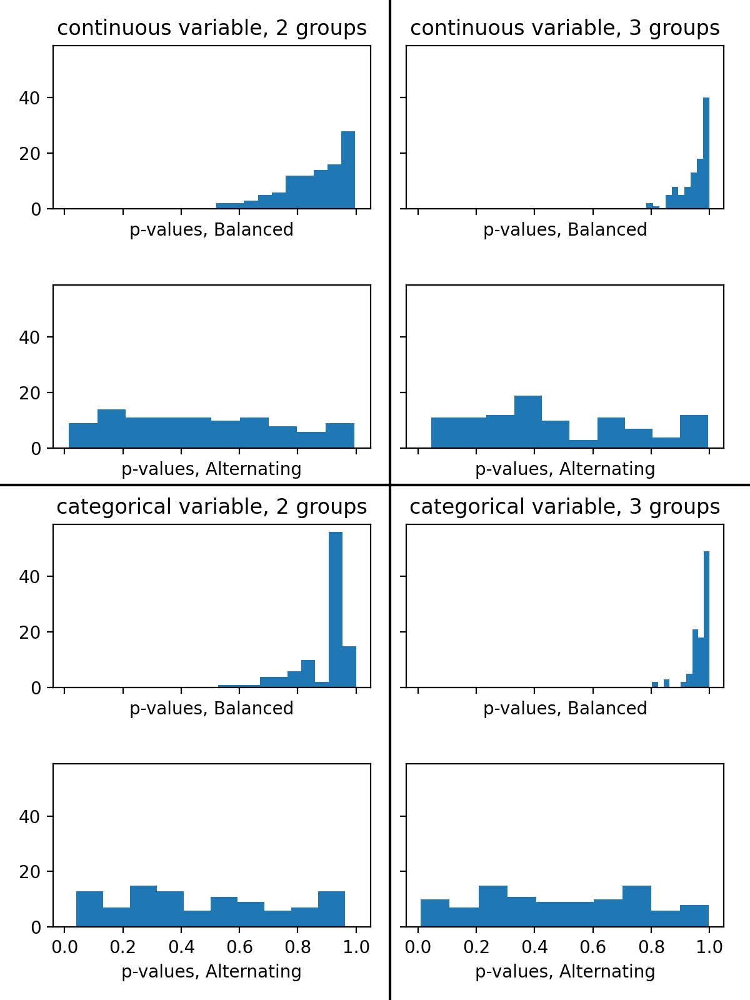
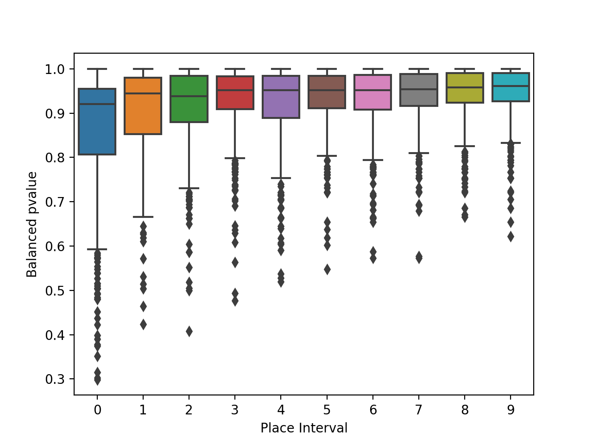
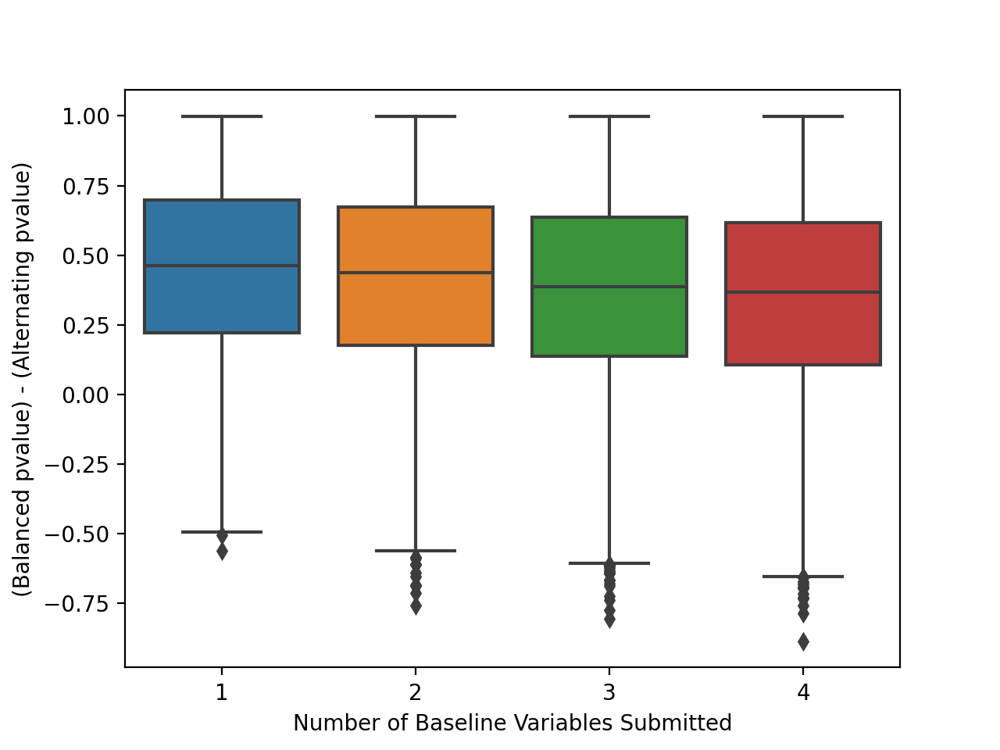
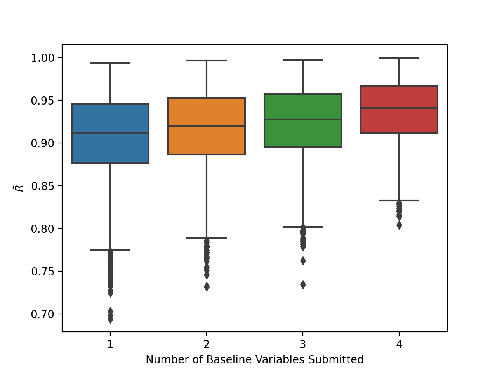

# <h1> <i>prospective-randomizer</i>: Java server that assigns subjects to matched experimental groups </h1>

- [Introduction](#introduction)
- [Methods](#methods)
- [Implementation](#implementation)
  - [Compiling and Running](#compiling-and-running)
  - [Limitations and future work](#limitations-and-future-work)
- [Results](#results)

# Introduction

Experimental science seeks to infer causality by isolating the effect of an intervention,
uncontaminated by confounding factors.

Standard teaching on experimental design is, to quote [Munnangi and Boktor 2024](https://pubmed.ncbi.nlm.nih.gov/29262004/):
> Randomized... control trials (RCT) are considered the gold standard of study design...
> Randomization in RCT avoids confounding and minimizes selection bias.
> This enables the researcher to have similar experimental and control groups,
> thereby enabling them to isolate the effect of an intervention.

But is it in fact the _randomization_ that obtains all these advantages? Randomization as compared
to what?

An _observational_ study is likely to be plagued by confounding factors: for example, in a
case-control study contrasting patients with heart disease to healthy subjects, it is difficult to isolate
the precise effect of one factor (such as exercise) given that the cases and controls are likely
to differ on many other factors as well (diet, genetics, socio-economic status, etc.) It is for
this reason that division of subjects into similar intervention and non-intervention groups is the
canonical method of experimentally establishing causality.

But how do we obtain similar groups? Classically the role of _randomization_ is stressed. Essentially,
a coin is flipped; or subjects are alternatively assigned A-B-A-B, with the assumption that the
random factors that influence the exact date of subjects' entry into a study effectively scrambles their
group assignment. This is in contrast to two notoriously bad study designs; one would be the application of some
fixed rule or bias to group assignment ("Shorter people will fit into the experimental rig with less hassle,
so let's put the shorter people in the experimental group..."), or the replacement of a coin or
randomization schedule with a human decision, which allows for whim or bias, either conscious or
unconscious ("Hmm, she looks like the type who would do well on this treatment.") In either case, effects
of the experimental intervention are _not_ isolated, and are confounded by biases in group selection.
However, surely now in the
21st century these are straw men: such studies would indeed be incredibly rare.

The existence of these _bad_ experimental designs demonstrate that it is easy to do _worse_ than
randomization in attempting to make groups similar and isolating intervention effects. But can we do _better_?

The law of large numbers dictates that with sufficiently large group sizes, the mean (of whatever feature)
of a randomly selected group
will approach the population mean, thus ensuring that all randomly selected groups will be similar
in baseline features.
In an ideal world all studies would have large N; however this ideal is often out of reach.
Many studies in fields such as psychology, education, circadian biology, etc. suffer the triple
challenges of stingier funding, more intensive research protocols, and higher variance in
both features and
outcome measures. Economics have hampered researchers' ability to run large-N studies even when they have
the patience and motivation to do so. But at smaller N, sampling error becomes a large problem, with the standard 
error of the mean equal to the standard deviation divided by the square root of the sample size:

$$
s.e.m. = \frac{std dev}{\sqrt{n}}
$$

Thus as the sample size, $n$, decreases, or as the standard deviation increasees, 
the likely sample error increases. Classically variance has been
minimized by selecting subjects from a relatively homogeneous population, _e.g._,
only selecting students between 18 and 22 at
a specific university. Ideally, to avoid confounding factors, one would have identical 
subjects in each experimental group. In
some experiments this is nearly possible, by ordering a litter of six-week-old male inbreed Wistar
lab rats from the same supplier, all kept in the same type of enclosure and fed the same type of chow
their entire lives. But given the difficulties in translating results from animal studies, and the
desire to have broadly applicable results, may studies use human subjects, and apply very few exclusion criteria.
Given the diversity of humans compared to lab animals, it becomes unfortunately likely that group sampling differences 
in a small-N study will have significant baseline (pre-intervention) differences between groups.

In human studies, all measurable features of subjects will have some more or less broad distribution.
Without the resources to go out and search for a subject similar to a subject in group A to put into
group B, we cannot match subjects, but can
perhaps hope to match groups, at least on selected features. With small-N studies, it is not uncommon for
outcome measures to differ more at baseline than after the experimental intervention, posing challenges for interpretation. Thus, while one hopes for an outcome similar to this:

|                 | Pre-test | Post-test | Delta |
| :---            | :---:    | :---:     | :---: |
| Intervention    | 100      | 110       | 10    |
| Placebo control | 100      | 100       |  0    |

It is not uncommon  to end up with data more like this:

|                 | Pre-test | Post-test | Delta |
| :---            | :---:    | :---:     | :---: |
| Intervention    | 100      | 110       | 10    |
| Placebo control | 110      | 110       |  0    |

Thus, while the intervention effect is the same in both situations, randomization of subjects in the second has the
unfortunate outcome that baseline means differ between the two groups, often significantly, and the post-test values 
are the same for both groups. While one can, and should, make the argument that it is the intervention effect 
that is statistically most important, one is nevertheless left unable to conclude that the intervention leads to a 
higher post-test value, and both reviewers and readers often conclude that the desired intervention effect was 
not achieved, all because of a baseline difference in group values.

At first glance, this would appear to just be bad luck; that this is inevitable some fraction of the time in 
small-N studies. But in fact, this is not true. “Prospective randomization,” described in detail below can 
dramatically decrease the frequency and size of such baseline group differences.

# Methods

PR-2.1 is the simplest version of the progressive randomization algorithm. It adds subjects to two groups one at a time, keeping the mean value of a critical feature approximately the same across two groups, while also keeping the groups of equal size. 
```
Compare the sizes of the groups.
If the two groups are the same size:
    Compare the feature value for the subject to the mean of all subjects enrolled so far.
    If the value is less than the overall mean:
        Add the subject to the group with the higher mean.
    Otherwise:
        Add the subject to the group with the lower mean.
Otherwise:
    Add the subject to the smaller group. This is necessary to keep the group sizes the same.
```
#### More than two groups
PR-3.1 is a simple generalization. It adds subjects to 3 (or more) groups one at a time, achieving the same goals as above.
```
Find the smallest group size.
Find the groups whose size is equal to the smallest group size.
If there are two or more such groups:
    Compare the feature value for the subject to the mean of all subjects enrolled so far.
    If the value is less than the overall mean:
        Add the subject to the smallest-group-size group with the highest mean.
    Otherwise:
        Add the subject to the smallest-group-size group with the lowest mean.
Otherwise:
    Add the subject to the one group of smallest size.
```    
Note that at this point, the algorithm will give the exact same results if, before each iteration of the algorithm, 
we replace the feature values with z-score normalized feature values (that is, values with the mean subtracted, 
divided by the standard deviation). For example, suppose the mean value for all subjects enrolled so far is 5.0, 
the mean of group A is 4.5, the mean of group B is 5.5, and we are deciding where to place a new subject with 
value 4.0. The rule above stating “If the value is less than the overall mean: Add the subject to the 
smallest-group-size group with the highest mean” kicks in, and of course we place this subject into group B. 
If we replace the values with normalized values (assuming std. dev. = 1.0), the mean for all becomes 0.0, 
group A’s mean is -0.5, group B’s mean is 0.5, and the new subject’s value is -1.0. Since -1.0 is smaller 
than 0.0, we once again choose the group with the larger mean, which is once again B (at 0.5 rather than -0.5). 
More generally, we choose the group for which the product of the groups mean and the subject’s feature value 
is negative (0.5 * -1.0 = -0.5). This is a rule that works in the opposite direction as well: if the new 
subject had a greater than average feature value (z-scored normalized to 1.0, say), we would be choosing 
the group with the negative mean value (-0.5 * 1.0 = -0.5). 

Using  z-score normalized feature values we can revise PR-3.1 thusly, getting rid of the inner 
less than/greater than conditional:
```
Find the smallest group size.
Find the groups whose size is equal to the smallest group size.
If there are two or more such groups:
    Compute the mean and standard deviation of the feature values for all subjects enrolled so far.
    Compute the z-score normalized value of the new subject’s feature value.
    For each of the smallest-group-size groups, compute the z-score normalized mean.
    For each of the smallest-group-size groups, compute the product of its normalized mean and the subject's.
    Add the new subject to the group for which this product is the least (i.e. most negative).
Otherwise:
    Add the subject to the one group of smallest size.
```
Getting rid of this conditional may seem like a pedantic coding style nit-pick at this point, but on the contrary: 
applying this most negative product rule allows us to develop an even more generalized algorithm.

#### More than one subject assigned at a time

PR-3.2 is the next level generalization. It adds subjects to 3 (or more) groups, two (or more) at a time, seeking 
the same goals as above. One could arbitrarily impose an ordering within each pair of subjects added and use the 
PR-3.1 algorithm; however, by allowing the algorithm to “peek ahead” a bit and choose which subject in the queue 
to engroup first, PR-3.2 achieves improved performance.
```
Compute the mean and standard deviation of the feature values for all subjects enrolled so far.
Compute the z-score normalized value of each of the new subject’s feature values.
While there are new subjects not yet assigned to groups:
    Find the smallest group size.
    Find the groups whose size is equal to the smallest group size.
    For each of the smallest-group-size groups, compute the z-score normalized mean.
    For each of the smallest-group-size groups, for each new subject,
        Compute the product of its normalized mean and the subject's.
    Add the new subject to the smallest-group-size group for which this product is the least.
```
Note that our remaining “if” statement has gone away: even if there isn’t more than one group at the smallest group size,
we still go through with the z-score normalization and comparing products, as we may be choosing between subjects. 
In general, if there are $n$ subjects remaining to be engrouped and $m$ minimum-sized groups, the algorithm is finding the least of $n * m$ products. Of course, if there is only one group at the smallest group size, and we are adding the only remaining new subject, the algorithm is constrained– we calculate one product, but it has no competition.

#### More than one critical feature: 
It may be difficult to anticipate what one feature is most important to try to equalize. Fortunately, this algorithm
easily generalizes to multiple dimensions. In place of a feature value, we use a vector of feature values, z-score 
normalizing each dimension independently. In place of calculating the product of a subject’s value and a group’s mean, 
we calculate the _dot_ product. Again, the subject/group pairing with the most-negative product wins. When we think of 
a group of subjects as a cloud of vectors (with the overall mean at the origin), hopefully the use of the most-negative
dot product becomes intuitively clear: we are selecting the vector that points away from the overall mean, and thus 
most pulls the aggregate back towards the origin. See Box 1 for a worked example.

PR-3.2.2 adds any number of subjects at a time to any number of groups based on any number of features. 
It is equivalent to (makes the same decisions as) the simpler algorithms given above when the applicable 
simplifying assumptions are true (i.e., two groups, one subject at a time, or only one feature).
```
Compute the means and standard deviations of each dimension of the features for all subjects enrolled so far.
Compute the z-score normalized vectors for each of the new subjects.
While there are new subjects not yet assigned to groups:
    Find the smallest group size.
    Find the groups whose size is equal to the smallest group size.
    For each of the smallest-group-size groups, compute the z-score normalized mean vector.
    For each of the smallest-group-size groups, for each new subject,
        Compute the dot product of its normalized mean and the subject's.
    Add the new subject to the smallest-group-size group for which this dot product is the least (i.e. most negative).
```
A drawback of equalizing more than one feature is that the more features are used, the poorer the expected 
equalization on any one dimension. Thus, unimportant features should not be used, lest they damage the equalization 
of more important features.

Non-numeric (i.e. categorical) features can be converted to numeric by encoding as one-hot features. 
A concern with this approach is that a single feature then potentially becomes
several feature, and thus makes several contributions to the dot product of the feature vectors.  This would 
give the categorical feature greater importance than other features; for this reason, the one-hot features 
are given a weighting of $1/n$ (where $n$ is the number of levels in the categorical).

While this approach could be applied manually (particularly if there is only one feature being equalized),
it is better to computerize the algorithm and leave humans out of the group-assignment loop, thus avoiding
both error and bias. In the realm of psychology, learning and memory, and education, many pre-intervention
assessments are (or can be computerized). Having the computerized task contact a server implementing the
group allocation algorithm allows for the group allocation to be done automatically,
covertly, and within milliseconds of the calculation of the pre-intervention feature.

# Implementation

We have written a Java implementation of the described algorithm. Setup requires identifying a computer that
can run a Java server and be connected to via TCP/IP; this can be deployed in the cloud for multi-site
studies, but may more cheaply be run on a local workstation. A number of other issues would have to be addressed
before rolling out a cloud deployment:
* This implementation does not include any authentication mechanism and thus would have to be wrapped in an
authentication layer (note, an on-campus deployment without adding an authentication layer is essentially "security through obscurity".)
* Information about subjects (their ID's, features, and group assignments) are stored in local text files, rather than a real database,
making these data more challenging to share across virtual hosts.
* Care has to be taken that if subject identifiers can be linked to individuals that any leakage of data would not be a violation of subject privacy.
  
Configuration requires specifying what
the groups are and what features are to be equalized across these groups. 

The algorithm has been wrapped in two different network protocols. The original, simple interface is over
a simple TCP/IP socket. All configuration must be done by manually editing the groups.txt and variables.xml
files. Client task processes open a socket connection and issue simple one-word commands to the server.
The same executable offers command-line interaction, so that researchers may interact with the algorithm
manually.

A more modern approach is taken by the Spring Boot wrapper. This allows client tasks to communicate with the
server using the HTTP protocol. For new work, it is recommended that the HTTP protocol is used. 

## Compiling and Running

To obtain the project, install `git`, and execute this command:
`git clone https://github.com/chhotii-alex/prospective-randomizer.git`

Also install:
* Java Development Kit (jdk) version 17.0 or above
* Apache maven

To build the command-line or simple socket implementation, enter these commands in your Terminal,
shell, or PowerShell:

```
cd prospective-randomizer
cd pros-rand-lib
mvn package
```

See the README files in either the `pros-rand-lib` or `pros-rand-boot` directories (depending on whether you wish to use 
the command line/simple socket or the HTTP interface respectively) for where to go from here.

## Limitations and future work
* As mentioned above, the "database" of subjects is not implemented as a real database; it's implemented as a simple text file, which is re-written after every transaction. This is okay for small local deployments&mdash;the number of subjects enrolled per unit time is not likely to be fast enough to run into the performance limitations of this approach. It does mean that care has to be taken to move the subject.txt file from machine to machine if the server is moved from one host to another. Generally this is not an issue with a small local study. However, this may make cloud deployment tricky. If the application is containerized, the local file system may not persist across re-starts, and re-starts can happen for various reasons (software crashes, load balancing, etc.) Ideally, SubjectDatabase would be implemented as a real database such as MySQL or Postgres.
* Likewise, relevant configuration of the study protocol such as groups and variables (features) would benefit from being persisted to a real database. Currently they are configured via local text files (for the socket/command-line implementation) or submitted at start-up from a web client (for the Sping Boot/API implementation) and then just held in memory. This is fragile in the face of any reboots, thus too fragile for cloud deployment.

# Results

We performed _in scilico_ experiments to simulate the use of this algorithm and test whether, when, and to what extent it would produce more desirable group randomizations.

### Using the BalancedRandomizer and having it distribute to groups based on one variable results in groups that are more similar than using AlternatingRandomizer.

We performed 100 simulated runs of each of these protocols: one continuous variable and 2 groups, one continuous variable and 3 groups,
one categorical variable and 2 groups, and one categorical variable and 3 groups.
In each case, we simulated enrolling 20 subjects in the protocol. In the cases where a continuous variable was used, the value of the variable was randomly selected from a Gaussian
distribution. When a categorical variable was used, an option was chosen with equal probability for each option.
For each simulated run, two simulated experiments were performed in parallel, which differed in how subjects 
were added to groups: in one, in the traditional manner, where subjects were assigned to groups in strictly alternating order ("Alternating"); and in the other, using the balanced
algorithm described above based on the one simulated variable ("Balanced").
After each simulated subject was submitted to the algorithm, their group assignment was not determined until after 4 additional subjects were submitted. Thus, the Balanced algorithm had
the benefit of more information about the overall sample when it made its decisions than if group assignments had been immediately demanded. (That is, GET came after several PUT commands,
rather than using PLACE.)
After each simulation, we measured the quality of the randomization of the subjects to the 2 or 3 groups.
When there were two groups and a continuous (numeric) feature was used, this measurement was the p-value of a non-paired t-test on the means of the feature values in each group.
When a continuous feature was used and there were three groups, a one-way ANOVA test of means was used.
When a categorical variable was used, the test was a chi-squared test that the distribution of feature levels did not differ between the 2 or 3 groups.
N.B., in this analysis, _higher_ p-values are more desirable&mdash;the more similar groups were, the higher the p-value. Lower p-values would indicate greater dissimilarity between groups at
baseline&mdash;exactly what the Balanced algorithm tries to avoid.

In the groups populated via the Alternating algorithm, these p-values were very close to the 0.5 that we would expect by chance (mean=0.48, median=0.45).

In the groups populated via the Balanced algorithm, these p-values were much higher (mean=0.92, median=0.95). For any given pair of simulations, the p-value resulting from the Balanced algorithm
was greater than from Alternating by 0.44 on average (paired t-test = -30.0,
p = $1.4 \times 10^{-104}$, df=399). The performance of the Balanced algorithm was not inevitibly superior in every case&mdash;the p-value for the Alternating randomizer was greater in 12% of the
simulated runs, because the Alternating algorithm will sometimes yield an ideal grouping by chance. However, the overall dramatic difference is apparent in Figure 1. 
<figure>
  
  <figcaption>Figure 1</figcaption>
</figure>

Drilling down by
number of groups and type of variable, we see that the same pattern appears across these variations (figure 2).

<figure>
  
  <figcaption>Figure 2</figcaption>
</figure>

What proportion of the time would the group distribution actually be a problem when using either algorithm? The Alternating algorithm yielded groups with a p-value of
less than 0.25 in 99 out of 400 runs (spot-on what we would expect from random chance.) For the Balanced algorithm, with the above-described parameters for the simulations, this never happened.

### Accumulating information about more subjects before doing a group assignment improves the algorithm's performance.

We did additional _in scilico_ experiments similar to those described above, but varying the interval between when any given subject's feature values were submitted to the algorithm and when their
group placement was requested. We allowed the algorithm to accumulate data on 0 to 9 additional subjects (but never more than 20 in total) after any one subject's data was submitted and before
their group placement was requested. This number of additional subjects is referred to as the _place interval_.

Increasing the place interval has a positive effect on p-values resulting from using the Balanced algorithm (see figure 3). A considerable advantage is gained by collecting data on just one
additional subjects before group assignment (place interval = 0 mean p-value = 0.86, place interval = 1 mean p-value = 0.90, difference = 0.048, unpaired t-test=-5.3, p= $1.2 \times 10^{-7}$, df=798).
Collecting data on
additional subjects before group assignment improves the algorithm's performance (Pearson correlation coefficent for p-value vs. place intervals between 1 and 9 = 0.95, $p=7.8 \times 10^{-5}$), but the
magnitude of improvement with each additional increment of place interval is not as large as the first (linear regression slope = 0.005, contrast with the slope between 0 and 1 = 0.048 above).

<figure>
  
  <figcaption>Figure 3</figcaption>
</figure>

The implication of this is that when using the Prospective Randomizer, it is more likely that a study will have a good outcome (in terms of having well-matched groups at baseline) if one can have
subjects go through the protocol in parallel, a few at a time, and submit the baseline values for more than one subject before their group assignments; but one need not bend over backwards for this.
The advantage of running many subjects in parallel over just a few is negligible.

### When using more than one variable, p-values are still better for Balanced than Alternating, but less so.

We also simulated protocols in which more than one baseline feature was taken into account for group assignment. For each subject, 4 feature values (all continuous, all categorical, or 2 continuous and
2 categorical) were randomly generated. For various simulated protocols, 1 to 4 of the feature values were submitted to the Prospective Randomizer. When we looked at the p-values of the differences between groups with regards to individual feature values, increasing the number of variables submitted decreased the advantage of Balanced over Alternating for any one variable (see figure 4) 
(Pearson correlation coefficient = -0.09, $p = 2 \times 10^{-162}$).

<figure>
  
  <figcaption>Figure 4</figcaption>
</figure>

### Using a measure of diversity reveals that using multiple variables results in overall more similar groups.

The previous analysis might be read as casting a bad light on the use of more than one variable. Submitting more than one variable does not degrade the performance of the algorithm, but it does diminish
the power of any one dimension to drive group assignment. Like sibings, the dimensions may not always agree, and have to share. The question is, by using more than one feature, are the subjects
_overall_ better randomized, taking all dimensions into account?

Human subjects are extremely diverse. _Diversity_ can be given an exact mathematical definition, related to measures of entropy. The mathematics of quantifying diversity has been well-developed
in the field of ecology [cite L&C]. Fortunately for us, the ecoologists have thought long and hard about how to quantify the partitioning of diversity&mdash;i.e. how much diversity there is
between subgroups ("subcommunities") of a larger overall group ("metacommunity") [cite Reeve].
This mathematical framework is proving to be useful beyond ecology [cite greylock paper, alpha paper]. A useful measure of what
we are trying to do that is provided by this framework is $\bar{R}$, the average redundancies of the subcommunities; in other words, to what extent are individuals in one group similar to
members of other groups. $\bar{R}$ equals 1.0 when the composition of each group is identical. Rather surprisingly, $\bar{R}$ can exceed 1.0 when typically a member of one group is more
similar to some members of other groups than any member of their own group.

We used the `greylock` python package [citation] to calculate $\bar{R}$ for the group composition of each simulated run of each protocol. Similarity between subjects was defined to take into account
values of all 4 of the features generated for each subject. Either 1, 2, 3, or 4 feature values were submitted to the algorithm consistently throughout each protocol.
As figure 5 shows, the more variables submitted to the algorithm, the higher $\bar{R}$ is on average (Pearson correlation coefficient = 0.25, p = 0).

<figure>
  
  <figcaption>Figure 5</figcaption>
</figure>


